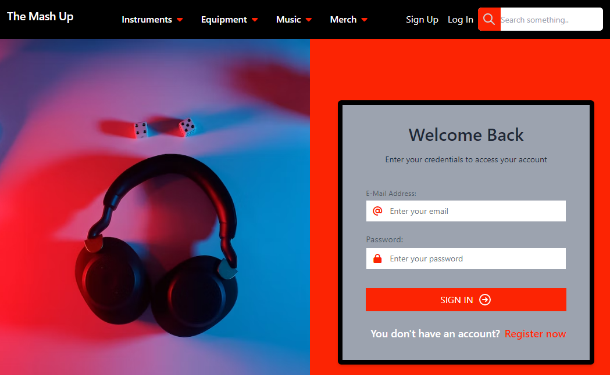

# The Mash Up
  
  ## Description
  The Mash Up is an e-commerce application that allows users to sign up, login, shop for music related products, add them to their cart, and checkout. As well as post user generated items for sale. The application is built using React, Vite, Apollo Server, and GraphQL.
  

  ## Table of Contents
  * [Installation](#installation)

  * [Usage](#usage)

  * [Deployed Application](#deployed-application)

  * [Screenshot](#screenshot)

  * [License](#license)

  * [Contributing](#contributing)

  * [Tests](#tests)

  * [Questions](#questions)

  * [Credits](#credits)

  

  ## Installation
  - Clone the repository onto your local machine.
  - Open the integrated terminal from the root package.json file.
  - Enter <code>npm i</code> to install all dependencies.
  
  ## Usage
  After cloning the repo and installing all dev dependencies, you can run the application by typing in <code>npm run develop</code> in the integrated terminal. This will open the app in your browser.

  ## Deployed Application
  [The Mash Up](https://the-mash-up-b8a52234a88b.herokuapp.com/)

  ## Screenshot
  
  
  
  ## License
  Notice: This application is covered under the The MIT license (MIT).

  ## Contributing
  At this time there are no plans to include contributions to this project. 

  
  ## Questions
  Please reach out to one of the team below if you have any questions.

  Email: [Adam Hood](adamhood15@gmail.com) 
  Email: [Kyle Curry](kyry.curry@gmail.com) 
  Email: [Phil Pfister](salshouse@gmail.com)
  
  ## Credits
 [Adam Hood](https://github.com/adamhood15) 
 [Kyle Curry](https://github.com/HotBarbeque) 
 [Phil Pfister](https://github.com/Phil-Pfister)